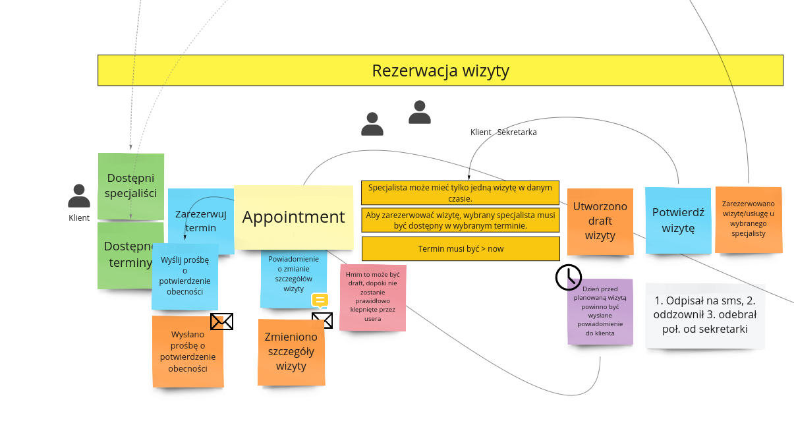

# Booking request api

It's a project written in `Nest JS` framework at the top of `Node` with `Type Script` support.

Project is a single agnostic microservice that outlines the logic for `BookingRequest` process.

## Business logic



### Flow in few words

As the `client` of the `company` that provides some e.g. medical services, using
`a booking app`, we (and many other `clients`) can `book` an appotiment
with an `expert` in `available` `time range`.

There many other users (clients) can book the same `available` date (concurrency heuristic), but only the first
client who approve the `apoptiment` will be allowed to got this meeting with an `expert`.

`Experts` needs to define them `availability` but it's out of the scope of this service.

**The only responsibility of this APP is handling `BookingRequest`** - creating draft, confirming, canceling.

## Development

This project supports `Makefile`, type `make`:

```text
fast                           Attempts to start existing containers
linting                        Executes linting in the way like CI&CD should do it
linting_fix                    Run linter with --fix flag
start                          Starts containers with build
stop                           Stops containers and removes network
tests                          Executes all tests
tests_end-to-end               Executes e2e tests in the way like CI and CD should do it
tests_unit                     Executes unit tests in the way like CI&CD should do it
tests_unit_watch               Executes unit tests with volume binding and watch mode (needs `tests_unit` command to be executed firstly)
```

Type `make start` to run local environment with all external dependencies - mocks.
Also DB is not set, all data is kept `inMemoryRepository`.

### Stack

In order to run this project, it is required to have:

- `Docker` + `docker-compose`,
- Some DDD architecture knowledge,
- Basic `Nest JS`, `Java Script` and `Type Script` knowledge.

### Architecture

This project supports layered architecture, in Domain design in mind - so Domain logic
is the most important part that should be fully `unit tested`.

If something is not explicitly described here, use common `Nest JS` conversions.

#### Domain

Third party code should not be used for describing business logic, except metadata (decorators).

#### Application layer

Uses `command bus` in order to change the system state. No returns should be allowed from this type of actions.

#### Infrastructure

Use as many recommended Nest JS building blocks as possible. Organize dir structure flat, or nested in 
`BundleName` if it's something third party specific.

#### UI

`API` responses should contain key `item` for single entity and `collection` for multiple.
If there is a need some additional data must be passed in `metadata` key, beyond item or collection.
